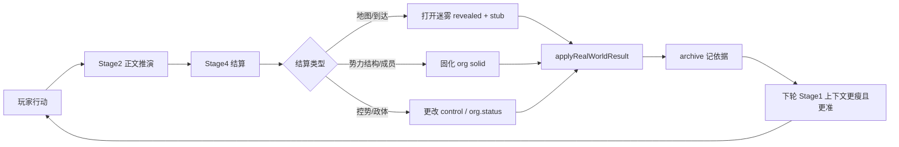

# 组织—领土控势系统设计

> 状态：设计稿 v0.9（§1 四条原则汇总 + 合规对照）  
> 日期：2026-07-04  
> 关联：`real-world-agent-loop`、`real-world-actions`、`real-world-map-fog`、`factionArchive`、Stage4 结算

---

## 0. 核心机制（总纲）

**本系统的主路径只有一条：通过现实推演去打开迷雾、固化细节、更改组织与控势。**

玩家提交行动 → Stage2 正文推演 → Stage4 结算 → `applyRealWorldResult` 写库 → 下一轮上下文变「更已知」。  
**不是**开局全量生成，**不是**靠手动填表改世界；势力 APP「全量检视」只是 **辅助审计**，不能替代推演闭环。

### 0.1 三件事，都靠推演闭合

| 机制 | 含义 | 典型触发（均在推演链内） | 写入哪里 |
| --- | --- | --- | --- |
| **打开迷雾** | 从未知 → 可引用的一行 stub / 地图可见 | 玩家到达新 POI；正文点名新组织/新地点；首访解锁周围建筑 | 地图 `revealed/visited`；org `L1 stub`；控势 inherit 一行 |
| **固化** | 从 stub → 可存档、可判定的结构事实 | 办事/入职/深交互；结算确认部门、职位、能力 | org `L3 solid` + `membership`；`factionArchive`；可选 `L4 audited` |
| **更改** | 模拟世界变化（夺控、独立、并购、解散） | 正文确认政体/控区变化；Stage4 输出对应结算 | `territory-control`、`org-status`；`controlHistory`；relations |



### 0.2 推演链上的固定挂载点（代码已有 / 待扩展）

| 阶段 | 职责 | 组织/控势/迷雾 |
| --- | --- | --- |
| **Stage 1** | 上下文 | 只注入 **已打开** 的 org stub + revealed 控势一行 + archive 片段（按需 Skill） |
| **Stage 2** | 正文 | 可写「听说/抵达/观察」；**不得**与已固化控势矛盾；未 revealed 处不得写细 |
| **Stage 4** | 结算 | **唯一合法入口**：固化、更改 org/控势/成员（见 §0.3） |
| **apply** | 写库 | `real-world-actions.applyRealWorldResult`：地图更新 → **fog** → 势力/控势 apply → archive |
| **下轮** | 反馈 | 新 revealed POI、新 solid org 自动进入 Hot 段 |

现有代码锚点：

- 迷雾：`realWorldMapFog.afterLocationUpdate`（`real-world-actions.js` 在地点变更后调用）
- 势力档案：`factionArchive.recordRealWorld`（推演结束后 append）
- 结算：`real-world-agent-loop` Stage4 分组（势力总览/结构、地图、人事安排…）

### 0.3 Stage4 结算类型 ↔ 三大机制

| 机制 | updateType / 结算组 | 必要条件 |
| --- | --- | --- |
| 打开迷雾 | `map-update`（新 POI、地点事实） | 正文：到达、看见、确认存在 |
| 打开迷雾 | 隐含：`afterLocationUpdate` → `revealed` | 玩家进入地图锚点（代码 + 首访 AI 解锁邻域） |
| 打开迷雾 | `faction-overview`（**仅**新建 org stub） | 正文首次点名该组织；**禁止**带完整 structure |
| 固化 | `faction-structure`、`membership`、角色卡·人事归属 | 正文：职位/部门/身份确认 |
| 固化 | `org-overview-panel` | 正文：涉及政治/经济/资产/军事事实 |
| 固化 | `org-overview-panel` | 正文：**新设**具体条目（如兵种、科室、产线、资产包） |
| 更改 | `territory-control` | 正文：夺控、解放、移交、占领 |
| 更改 | `org-status` | 正文：独立、起义、解散、合并 |

**无 Stage4 行、无等价 genericUpdate → 不得固化、不得更改控势/org。**  
Stage2 可预告，变更 **下轮生效**（见 §13.6）。

### 0.4 非推演路径（从属、受限）

| 入口 | 定位 | 限制 |
| --- | --- | --- |
| 势力 APP「全量检视 / audit」 | 补全 **已 exposure≥1** 的 org；写 fieldReasons | 不得凭空创建未在推演中出现的 org 树；不得改无 archive 依据的控势 |
| 代码 bootstrap | 新存档：国家/公司/住址 **L1 stub** | 不算「固化」；等第一次推演接触再升 L2+ |
| 公司 APP sync | 公司 → org structure 单向同步 | 视为「玩家已接触公司」的固化辅助，仍应有 employment/上班类推演依据 |
| 用户编辑 JSON / 调试用 | 开发 | 非玩家主路径 |

### 0.5 迷雾与分辨率（同一件事的两面）

| 地图 | 组织 | 规则 |
| --- | --- | --- |
| `!revealed` | org absent 或不在 Index | 不进 prompt；正文只能模糊提及 |
| `revealed` | org L1 stub | Index 一行；地图控势 inherit 一行 |
| `visited` | org L2+ | Hot 段；可输出 sketch / 局部 solid |
| 结算固化后 | L3 solid | 结构、能力、控势 history 落库，下轮必带上 |

**打开迷雾 ≠ 固化**：首访邻楼只有 revealed + stub；**固化**要等结算或深度接触（§5）。

### 0.6 设计约束（一句话）

> 世界只能长到 **推演已经证明** 的地方；长到的地方 **必须写进存档**，并 **可以改变**。

### 0.7 组织内迷雾（你要求的核心语义）

**不仅「整个势力」有迷雾，组织内部的每一个机构、兵种、科室、产线也可以单独处于迷雾。**

| 你的要求 | 设计对应 |
| --- | --- |
| 成立某机构/兵种，**没给草案** | 只创建 **条目**（名称 + 意图），`state: fog`；**不生成**上级、编制、装备、职能细节 |
| 推演越聊越清楚 | 条目 `fog → sketch`，组织架构 **显示随之调整**（上级、人数、归属可改） |
| **一旦确立** | 条目 `state: established`；此后任何修改 = **更改**，Stage2 正文须有 **事实落地** + Stage4 结算 |
| 兵种归哪级管 **未明确** | 该条目的 `parentRef` = **迷雾**（UI 显示「上级：迷雾」）；**禁止** AI 默认挂「国防部/总参谋部」等 |

```text
成立「黑盾特遣队」（无草案）
  → military.entries[] 新增 { name, state: fog, parentRef: fog }
  → 势力 APP：军事 ▾ 黑盾特遣队｜上级：迷雾｜状态：未确立

推演：明确隶属某司令部
  → Stage4 更新 parentRef（仍 sketch，未确立）
  → UI：上级：某某司令部（草案）

推演：正式列编/盖章/任命
  → Stage4 标记 established
  → 之后再改隶属 = 更改，必须正文有依据
```

**与 §0.5 整 org 迷雾的关系**：org 可以是 L2 sketch，其下同时存在 **fog 条目 + established 条目**；能力四维 **不是固定填空表**，而是 **动态 entries 列表**（见 §4.5）。

**自由度总原则（你的预想）**：见 **§1 原则二、原则三**（草案期可调 / 分项迷雾）。

---

## 1. 设计原则（四条）

本节为全文 **最高优先级**；后文数据模型、结算、UI 均不得与之冲突。

### 原则一：推演驱动写库

| 要点 | 说明 |
| --- | --- |
| 主路径 | 玩家行动 → Stage2 正文 → **Stage4 结算** → apply → 存档 |
| 禁止 | 无 Stage4 → **不得**写库变更；**不得**无正文改 **已确立** 项 |
| 辅助 | 势力 audit、公司 sync、bootstrap 仅补 stub 或审计 **已接触** org，**不替代**推演 |

### 原则二：强自由度 — 未确立随推演调整

| 要点 | 说明 |
| --- | --- |
| 适用范围 | `state: fog` 或 `sketch` 的 org 条目、部门、职位、兵种 entry、控势（未 locked） |
| 可调内容 | 名称、上级归属、职责、任职人、编制说明、parentRef、sketchNote 等 **任意子集** |
| 条件 | Stage2 正文有 **合理事实逻辑** + 同轮 Stage4 对应行 |
| 不必一次写全 | 本轮只明确职责 → 下轮再明确人，合法 |

### 原则三：不清楚即迷雾

| 要点 | 说明 |
| --- | --- |
| 粒度 | 整 org、部门、职位（名称/职责/人分项）、兵种上级、地图 POI、任职人均可 **单独迷雾** |
| 显示 | UI / prompt 写「迷雾」「未确立」「草案」；**禁止** AI/audit 猜默认值（如国防部、匿名负责人） |
| 正文未推到 | 保持迷雾；路人提及 ≠ 任职确认 |

### 原则四：已确立 — 无正文事实不得修改

| 要点 | 说明 |
| --- | --- |
| 确立标志 | `state: established`（或控势/职位/条目经 Stage4「确立/列编/生效」） |
| 修改门槛 | **必须** Stage2 正文 **硬事实**（任命、命令、登记、夺控等）+ Stage4 **更改** 类结算 |
| 禁止 | 静默回滚；audit 覆盖；无 archive 依据的改写 |
| Stage2 | 可预告变更；**下轮** apply 后叙事才与存档一致（§13.6） |

### 1.1 原则 ↔ 机制 ↔ 文档索引

| 原则 | 对应机制（§0.1） | 主要章节 |
| --- | --- | --- |
| 推演驱动 | 打开迷雾 / 固化 / 更改 均经 Stage4 | §0、§5、§16.3 |
| 强自由度 | sketch 期微调 | §3.5–§3.6、§4.5–§4.7 |
| 不清楚即迷雾 | fog 字段、`parentRef.fog`、`titleFog`… | §0.7、§3.6、§7.2 |
| 已确立不可无文改 | 更改 + changeLog | §3.5、§4.6、§13.6 |

### 1.2 合规自查（实现 / 审 prompt 时用）

| 检查项 | 通过标准 |
| --- | --- |
| C1 | 任何存档字段从 fog→非 fog 或 sketch→established，能指向 archive + Stage4 reason |
| C2 | established 字段 mutate 时，有正文 evidence 字段或 settlement「更改」 |
| C3 | 未在正文出现的上级/人/职责，对应 `*Fog: true` 或 absent |
| C4 | sketch 期同 id 条目可被 upsert 改名/改上级，不要求删了重建 |
| C5 | audit 全量检视未 exposure 的 org 不出 structure 树 |
| C6 | 地图未 revealed 的控势不进 Stage1 默认 context |

### 1.3 状态机（一句话）

```text
迷雾(fog) ──正文+Stage4──► 草案(sketch) ──确立+Stage4──► 已确立(established)
     │                           │                              │
     └─ 分项仍可有 *Fog          └─ 可随推演任意调整              └─ 无正文事实不可改
```

---

## 2. 目标与非目标
### 2.1 目标

1. **最大程度模拟现实组织架构**：法域 → 辖区 → 公权力/市场组织 → 成员，而非扁平「势力列表」。组织 **森林模型**（多域、国立/私立、骨架固定/名字 AI 填、**成立门槛**、**所属势力展示**）见 **`faction-org-forest-design.md` v1.3.3**。
2. **推演驱动**：打开迷雾、固化、更改 **均通过 Stage2→Stage4→apply 闭环**（见 §0）；可模拟、可变更（起义、独立、并购等）。
3. **上下文节约**：未打开处仅 stub/不可见；打开且固化后才进 Hot 段（§0.5、§8）。
4. **地图联动**：可见 POI 标明实控/宣称 orgId（§7）。
5. **能力按需展开**：政治/经济/资产/军事 随推演接触写入（§16.7）。
6. **存档重构**：渐进迁移 `factions[]`、`membership`（§11）。

### 2.2 非目标（本阶段不做）

- 不做 RTS/战棋级兵棋推演（单位、补给线、每日战报）。
- 不做全球全量政府树预生成（开局不展开全国人大等机构树）。
- 不替代 **异世界 worldline** 的 `factionMap`（本设计仅 **2026 现代都市现实世界**）。
- 不把 **线上社群/微信群** 硬绑到地理控势（见 §8.3 边界）。

---

## 3. 现状与问题

### 3.1 现有模块

| 模块 | 文件 | 现状 |
| --- | --- | --- |
| 势力 APP | `faction-system.js`、`faction-actions.js`、`faction-ai-actions.js` | 全局 `factions[]`，满字段卡片；`fixed: true`；全量 audit 倾向一次生成 structure |
| 角色人事归属 | `social-position.js`、`membership` | 字符串 `force/position`，无 `orgId` |
| 势力档案 | `faction-archive.js` | 按势力 append 段落，冷存储；已有 `contextFor` 按需检索 |
| 电子地图 | `real-world-map.js`、`real-world-map-fog.js` | 树形 POI + 迷雾；**无控势字段** |
| 结算 | `faction-overview-update`、`faction-structure-update`、`map-update` | 组织与地图 **未统一** 处理控势/独立 |
| 公司 | `company-faction-actions.js` | 单向 sync 公司 → 势力 structure |

### 3.2 核心矛盾

1. **双写漂移**：势力 structure 占坑 vs 角色卡 `membership` 仅字符串匹配。
2. **开局过重 / 脱离推演**：`faction-audit` 一次生成整树；应改为 **仅 audit 推演已点名的 org**（§0.4）。
3. **静态假设 vs 模拟**：`已有势力不能随意重写` 应改为 **「无 Stage4 依据不改；有 territory/org 结算必改」**（§0.3）。
4. **地图无归属**：无法表达「这栋楼现在谁说了算」。
5. **能力维度缺失**：`influence` 单数字 + `resources[]` 字符串，无法支撑政治/经济/资产/军事分层推演。

---

## 4. 核心概念

### 4.1 双轨模型

```text
组织注册表（Org Registry）  →  「有哪些实体、什么状态、谁能干什么」
领土控势索引（Territory）     →  「哪块地图归谁实际控制 / 谁宣称」
```

二者 **耦合但不等价**：

- 组织可存在但不控制任何已揭示地点（流亡政府、空壳公司）。
- 地点可被 A 实际控制、B 法理宣称（争夺、独立过渡期）。
- 同一 org 可控制多地点；同一地点在同一时刻 **仅一个 effectiveOrgId**（特殊见 §6.4）。

### 4.2 分辨率

组织与控势均适用 **L0–L4** 分辨率，与地图 `revealed/visited` 对齐：

| 级别 | 名称 | 组织侧 | 控势侧 | 默认进 prompt |
| --- | --- | --- | --- | --- |
| L0 | absent | 未登记 | 未登记 | 否 |
| L1 | stub | 名+类型+上级指针+≤40字 | 继承法域一行 | Index 段 |
| L2 | sketch | 归属链、地域、规模、领域标签 | effective/claim/status 一行 | Index + 相关 Hot |
| L3 | solid | 局部 structure、relations、能力槽 | 完整 control + 最近变更 | Hot 段 |
| L4 | audited | fieldReasons + changeLog | controlHistory 完整 | Skill 按需 |

**铁律**：接触（见 §5）触发 **至少 +1 级**；L3 以下不得输出完整 structure 树。

### 4.3 组织生命周期

| status | 含义 |
| --- | --- |
| `active` | 正常运作 |
| `rebel` | 起义/割据，与上级 claim 冲突 |
| `independent` | 已独立法域（新 org 或原 org 升格） |
| `dissolved` | 解散、注销、取缔 |
| `merged` | 已被合并（保留 predecessor 链） |

附加字段建议：`legitimacy`（`recognized` / `contested` / `unrecognized`）、`predecessorIds[]`、`successorIds[]`。

### 4.4 控势状态

| status | 含义 |
| --- | --- |
| `stable` | 实控与宣称一致，无显著冲突 |
| `contested` | 多方争夺或双宣称 |
| `occupied` | 外来强力占据（占领/托管） |
| `autonomous` | 高度自治但未独立（一国两制式抽象） |

### 4.5 组织内条目三态

适用于 `structure[]` 节点、`overviewPanels.*.entries[]`（兵种、科室、资产包、监管口等）。

| state | 含义 | 能否随推演调整 | 进默认 prompt |
| --- | --- | --- | --- |
| **fog** | 仅知「要成立 X」或「存在 X 这个名字」；**无草案** | 是（仍须 Stage4） | 仅 org 内一行：`X｜上级迷雾｜未确立` |
| **sketch** | 推演已部分清晰（上级草案、规模、职能描述等） | **是**——每轮可据正文微调 | sketch 摘要 |
| **established** | 已确立（列编、注册、任命、章程生效等正文事实） | **否**——按「更改」规则 | established 摘要 |

**上级迷雾规则**：

```js
parentRef: {
  fog: true,              // true → 上级未明，禁止猜
  orgNodeId: null,        // 明确后指向 structure 节点 id 或 org id
  label: '迷雾',          // UI / prompt 用
}
```

- `parentRef.fog === true` 时，**不得**写入具体上级名称到存档（Stage4 也不行，除非同轮正文明确）。
- 从 fog → 有上级：必须 Stage4 行 + 正文依据；可保持 `sketch`（尚未确立整编）。

**确立门槛（fog/sketch → established）**：Stage4 须含「确立/列编/注册/生效」类 field，且 reason 引用正文 **硬事实**（签字、命令号、工商登记、任命等），不是「大概这么定」。

**已确立后修改**：走 §0.1 **更改**；正文必须写清 **变更事实**，与改控势、改 org.status 同级。

### 4.6 职位分项迷雾

部门下的 **职位** 不是一张死表；每个字段单独算「知不知道」：

| 字段 | 迷雾时 | sketch 时（正文有部分事实） | established 后 |
| --- | --- | --- | --- |
| **职位名称** | `titleFog: true`，显示「职位：迷雾」 | 有名称，可随正文改名（Stage4） | 改名 = 更改 |
| **职责** | `dutyFog: true` 或空 | `dutyNote` 随推演补全、可改 | 改职责 = 更改 |
| **任职人** | `occupantFog: true` 或 `未知` | 介绍卡/角色卡绑定，可换人（Stage4） | 换人 = 更改 |

```js
// structure[].roles[] — 分项迷雾示例
{
  title: '',              titleFog: true,    // 只知「这里要有个岗」，不知叫啥
  dutyNote: '',           dutyFog: true,
  occupants: [],          occupantFog: true, // 不知谁上
  state: 'fog',
}
{
  title: '平台负责人',    titleFog: false,
  dutyNote: '',           dutyFog: true,     // 知道头衔，职责还没推演到
  occupants: [{ name: '未知', bindType: 'unknown' }], occupantFog: true,
  state: 'sketch',
}
{
  title: '产品经理', dutyNote: '负责需求与排期…', titleFog: false, dutyFog: false,
  occupants: [{ name: '许青', bindType: 'intro', characterId: '' }],
  state: 'sketch',        // 三者都有草案，但未「确立编制」
}
```

**调整规则**：

1. **fog / sketch 阶段**：正文出现合理新事实 → Stage4 可改 **名称、职责、人** 任意 subset；**不要求一次写全**。
2. **未在正文推演到的维度**：保持 **迷雾**，AI/audit **不得** 补全（例如只说了「新来的负责人」→ title 可 sketch，人仍 fog）。
3. **established 阶段**：三项任一变更都需 **正文硬事实 + Stage4「更改」**。
4. **整体 state** 取三字段 + 条目 state 的 **最保守** 展示（有任一 fog → UI 可标「部分迷雾」）。

---

## 5. 数据模型

### 5.1 组织节点

```js
{
  id: 'org-company-main',
  name: '成都星河云栈科技有限公司',
  kind: 'company',           // country | government | company | school | family | ngo | rebel | ...
  parentRef: 'country-china',
  jurisdictionRef: 'loc_chengdu',  // 可选：主辖区地图节点
  resolution: 'sketch',      // L1 stub | L2 sketch | L3 solid | L4 audited
  status: 'active',
  legitimacy: 'recognized',
  stub: '成都软件公司，归属中国法域。',
  sketch: { scale: '中小型', domain: '互联网', location: '成都' },
  solid: {
    structure: [],           // OrgStructureNode[]，见 §4.5
    relations: [],
    overviewPanels: {
      ideology: {
        core: { value: '', establishedAt: '', updatedAt: '', reason: '' },
        reason: { value: '', establishedAt: '', updatedAt: '', reason: '' },
        description: { value: '', establishedAt: '', updatedAt: '', reason: '' },
        base: { value: '', establishedAt: '', updatedAt: '', reason: '' },
        legitimacy: { value: 0, unit: '/100', establishedAt: '', updatedAt: '', reason: '' },
      },
      economy: { entries: {} },
      politics: { entries: {} },
      military: { entries: {} },
      diplomacy: { entries: {} },
    },
    overviewPanels: {
      political: { level: 'latent', entries: [] },
      economic:  { level: 'latent', entries: [] },
      asset:     { level: 'latent', entries: [] },
      military:  { level: 'latent', entries: [] },  // 重构后正式字段；长期由 overviewPanels + structure 吸收
    },
  },
  latent: {
    structureHint: '研发/运营/管理——未展开',
    overviewPanelsHint: '政治/军事未接触',
  },
  exposure: { score: 0, lastAt: '', reasons: [] },
  predecessorIds: [],
  successorIds: [],
  territoryAnchors: [],      // 显式绑定的 map node id
  fieldReasons: {},
  changeLog: [],
  updatedAt: '',
}
```

**与现有 `factions[]` 映射**：短期可在原对象上 **增量加字段**（`resolution`、`stub`、`status`、`solid`），避免大规模迁移；长期可 rename 为 `orgRegistry`。

#### 5.1.0 数据真源与重构替换

自 2026-07-06 起，本文对组织系统的数据权威顺序明确如下：

1. **长期真源**：`structure[]`、`membership`、`overviewPanels`
2. **结构分类真源**：`orgDomain`、`ownership`、`foundingType`、`parentId`
3. **重构后正式字段**：`solid.overviewPanels.*`、`values.membership`
4. **禁止升格为第六基础**：`asset` 仅可作为旧实现重构容器存在，**不得**继续作为与 `ideology / economy / politics / military / diplomacy` 并列的长期核心维度

这意味着：

- 新设计下，宏观总览只认 `overviewPanels.ideology / economy / politics / military / diplomacy`
- 组织真实任职关系只认 `membership`；`membership` 仅作为旧角色卡读写旧字段已移除保留
- 旧 `solid.overviewPanels` 仍可继续读写一段时间，但它在重构后内应被视为**派生视图 / 旧缓存已移除**，而不是新的事实真源
- 任何新增设计，都不得再把 `asset` 扩成第六大面板或第六类基础

### 5.1.1 宏观总览五面板（固定面板，动态字段）

**组织架构**与**势力总览**是两套系统：

- **组织架构**回答：有哪些单位、谁归谁管、谁担任什么职位。
- **势力总览**回答：这个势力整体有什么实力、在宏观上处于什么状态。

**社群与势力共用同一套组织设计与实现，五面板是它们共同的宏观总览结构。**

- 两者都使用同构的 `org registry` / `membership` / `overviewPanels` 结构。
- **势力**与**社群**的区别，不在于是否使用这套结构，而在于五大基础是否已经全部确立。
- 只要 `ideology`、`economy`、`politics`、`military`、`diplomacy` 五面板中有任一基础尚未建立、尚未被推演确立，分类上就仍是**社群**。
- 只有当五大基础全部确立后，才升级为**势力**。
- 一旦某对象曾经完整具备五大基础并被确认为势力，后续即使衰败、残缺、失能，也**不会退化回社群**，只会继续作为势力走向分裂、解体、合并或消亡。

总览固定为五大面板：

1. `ideology`（意识形态）
2. `economy`（经济）
3. `politics`（政治）
4. `military`（军事）
5. `diplomacy`（外交）

**固定的是面板，不固定的是字段名。**

- 面板名称固定，便于 UI、查询与结算统一。
- 面板内字段由推演事实或 Stage4 结算确立，**字段名不预写死**。
- 一旦字段被推演确立，就进入持续记录；后续只能在新事实基础上更新，**不得凭空改名、删掉或重写含义**。

#### 5.1.1.1 ideology 的字段语义（必须区分）

`ideology` 至少区分以下字段：

| 字段 | 含义 | 是否稳定 |
| --- | --- | --- |
| `core` | 核心意识形态名称，例如社会主义、自由主义、民族主义 | 高稳定 |
| `reason` | **历史形成原因**：为什么这个势力会形成该意识形态 | 高稳定 |
| `description` | **当前说明**：该意识形态围绕当前局势、阶级基础、统治目标是如何解释自己的 | 可随时代演化更新 |
| `base` | 当前主要代表或依托的阶级/群体基础 | 可更新 |
| `legitimacy` | 当前正当性/承认度数值 | 动态更新 |

**严格区分**：

- `reason` 回答“为什么会形成这个意识形态”。
- `description` 回答“这个意识形态在当前阶段如何解释自己、围绕谁、服务谁、主张什么”。

例如：

- 俄国式社会主义：
  - `reason`：因长期工业剥削、阶级压迫与旧政权专制，革命力量以工人阶级解放为意识形态核心。
  - `description`：当前以工人阶级为主导，强调先锋党领导、工业组织与无产阶级专政。
- 中国式社会主义：
  - `reason`：因半殖民地半封建压迫、农村人口占多数且土地矛盾尖锐，形成以工农联盟为基础的社会主义路线。
  - `description`：当前以工农阶级为基础，后期发展为中国特色社会主义，强调代表最广大人民利益。

#### 5.1.1.2 社群态的五面板语义映射

当一个 org 仍处于**社群**分类时，仍然使用同一套 `overviewPanels` 结构，但各面板在语义与 UI 上按下表解释：

| 固定面板 | 社群态语义 | 说明 |
| --- | --- | --- |
| `ideology` | `凝聚原因` | 回答“这群人为什么会聚在一起”；可沿用 `core / reason / description / base`，但语义转为共同兴趣、共同遭遇、共同目标、共同情感来源等 |
| `ideology.legitimacy` | `凝聚力` | 不再优先表示外部正当性，而表示社群内部粘性、成员认同度、持续参与意愿 |
| `economy` | `可用资源` | 表示社群当前能调动的资源；**固定至少包含 `money`（金钱）字段**，其余如场地、物资、设备、人脉、渠道等与势力经济一样，都是按推演事实确立、持续记录并动态更新的字段 |
| `politics` | `管理` | 表示社群内部如何协调、维护秩序、分派事务、处理争议；**默认管理方式为“沟通协同”**，除非推演已明确出现更强的规则、任命、处分或执行机制 |
| `military` | `隐藏` | 社群态默认不展示该面板；底层结构可保留空位，但 UI 隐藏，只有当推演明确出现武装、安保、暴力执行网络等事实时才显式展开 |
| `diplomacy` | `联谊` | 表示社群与其他社群、组织、圈层之间基于往来、认同、合作与排斥形成的**亲近度总览**；社群态以 `affinity`（友好/亲近程度）为核心轴 |

补充规则：

1. **社群态不是删除五面板，而是重解释五面板。**
2. `economy.money` 为社群态固定基础字段，不得缺省。
3. 除 `economy.money` 外，社群态 `economy` 的其余资源字段与势力 `economy` 完全一致，都是可变的动态字段，不预写死清单。
4. 社群态 `politics` 若尚无更强制度事实，默认按“沟通协同”处理，即以协商、联络、撮合、共识维系为主，而非强制命令链。
5. `military` 在社群态默认隐藏，但字段槽位仍保留，以便后续推演出现相关事实时直接转入显式记录。
6. 社群态 `diplomacy` 的最简记录结构可收束为：`targetId`、`affinity`、`reason`、`updatedAt`；其中 `affinity` 使用 `0-100` 表示友好/亲近程度。
7. 当社群补齐五大基础并升级为势力后，应把这些社群态语义逐步收束回势力态语义。

#### 5.1.1.2.1 格式塔意识的五面板语义映射

若某对象被明确设定为**统一意识**，则可直接作为单一组织实体建模，并复用同一套层级组织与 `overviewPanels` 结构。

其五面板语义如下：

| 固定面板 | 格式塔意识语义 | 说明 |
| --- | --- | --- |
| `ideology` | `格式塔意识` | `core` 固定为“格式塔意识”；`reason`、`description` 仍可动态记录其形成原因、自我理解与对外定义 |
| `politics` | `统一个体` | 不按常规分权/选举/继承理解，而表示统一意识如何控制各执行单元、感知单元与派生节点 |
| `economy` | `资源` | 不强调传统 GDP/税收，而记录其可消耗、可吸收、可积累的资源；字段仍为动态字段 |
| `military` | `军事` | 继续沿用通用军事骨架，不做特殊删改 |
| `diplomacy` | `外交` | 继续沿用通用外交骨架，不做特殊删改 |

补充规则：

1. 格式塔意识**不是**额外第六类基础，而是复用既有五面板后的特殊语义映射。
2. 若无统一意识、且又无可识别上下级结构，则不按单一组织实体处理，而应回到关系网络/多主体分散对象处理。
3. 格式塔意识的 `economy` 虽语义映射为“资源”，但除语义变化外，仍遵守“字段动态确立、事实锁定、持续更新”的总规则。

#### 5.1.1.3 其余四面板的动态字段规则

| 面板 | 字段规则 |
| --- | --- |
| `economy` | 允许出现 `GDP`、`ironOreReserve`、`ironOreOutputMonthly`、`grainOutputQuarterly`、`taxRevenue`、`area`、`population` 等任意已确立字段；当总量未知、增量未知或仅有变化事实时，允许先记录事实说明型字段，再于数值确立后升级 |
| `politics` | **不承载意识形态，也不承载利益集团本体**；其职责收缩为纯粹的治理结构与权力运行机制，固定围绕 `institution`、`participation`、`leadership`、`regime` 四组展开 |
| `military` | 采用**固定骨架 + 动态内容 + 事实锁定**模式，固定围绕 `forces`、`quality`、`sustainment`、`projection` 四组展开；具体兵力与能力字段由推演事实动态确立 |
| `diplomacy` | 采用**固定骨架 + 动态内容 + 事实锁定**模式，固定围绕 `subjects`、`relations`、`channels`、`posture` 四组展开；对外关系对象、关系状态、互动渠道与总体姿态由推演事实动态确立 |

#### 5.1.1.3.0 动态字段的“模糊但实时”规则

五面板中的动态字段，不要求一开始就完整、精确、全量；但要求**真实反映当前已被推演确立的事实**。

核心原则：

1. **没有总量时，不伪造总量**。例如只知道占领了某省、但不知道全势力总面积时，不得补写虚假的 `totalArea`。
2. **没有增量数值时，不伪造增量数值**。例如知道“控制范围扩大了”，但不知道新增面积具体多少时，不得补写估算数字冒充确立事实。
3. **没有数值时，先写事实说明**。允许先出现 `控制范围扩大`、`新增控制区：某省`、`新增资源节点：某港口`、`补给条件恶化` 这类说明型字段。
4. **数值一旦确立，再升级为数值字段**。例如后续推演明确某省面积、人口、矿产产能后，再写入 `controlledAreaKnown`、`controlledPopulationKnown`、`ironOreOutputMonthly` 等更精确字段。
5. **模糊不等于虚构**。模糊字段必须仍然是实时事实，只是精度不足，而不是 AI 为了补齐表格而臆造的完整数字。

可接受的三层状态：

- **已知总量**：直接显示完整字段，如 `controlledArea`、`population`
- **未知总量但已知增量/已知量**：显示 `knownArea`、`areaDelta`、`新增控制面积`、`已知人口`
- **连增量数值也未知，只知变化事实**：显示 `控制范围扩大`、`新增控制区：某省`、`资源版图扩张中` 等事实说明型字段

这条规则不仅适用于 `economy`，也适用于 `military`、`diplomacy`、`politics` 中所有“事实已发生但数值或精度未确立”的动态字段。

#### 5.1.1.3.1 politics 的固定骨架（治理结构，不含意识形态）

`politics` 在本设计中不是广义“政治生态”，而是**势力如何制定规则、裁决争议、执行命令、产生统治者并完成权力交接**。

因此：

- `ideology` 已独立到意识形态面板，不再放入 `politics`
- 利益集团若存在，也视为独立层，不并入 `politics` 主体定义
- `politics` 只保留**管理手段、权力结构、治理程序、统治者产生与交接机制**

**实现原则**：`politics` 采用**固定骨架 + 动态内容 + 事实锁定**模式。

- **固定骨架**：统一使用 `institution`、`participation`、`leadership`、`regime` 四组结构，便于查询、展示、比较与结算。
- **动态内容**：四组内部的具体内容不得预先写死，必须由 AI 根据正文、历史推演、Stage4 结算与已确立事实动态填写。
- **事实锁定**：一旦某项政治事实被推演确立，就进入持续记录；后续只能基于新事实更新其值、描述与状态，不能脱离推演凭空改写。

例如：

- `institution.rulemakingPower` 可能被推演为长老会、圣职会议、董事会、皇帝敕令或中央委员会，而不是预先写死。
- `participation.electionAllowed` 必须由事实决定是禁选举、限选举、代表选举还是开放选举。
- `leadership.selectionMethod` 必须由事实决定是世袭、推举、任命、选举、神授认证还是军事夺取。
- `regime` 也不是先验标签，而是由前三组事实归纳出的治理形态名称。

`politics` 固定分为四组：

1. `institution`
2. `participation`
3. `leadership`
4. `regime`

##### 5.1.1.3.1.1 institution（制度）

回答：这个势力内部的规则制定权、规则解释/裁决权、规则执行权是如何分配和组合的。

常见锚点字段（**非封闭清单**）：

| 字段 | 含义 |
| --- | --- |
| `rulemakingPower` | 规则制定权归属：谁能定规矩、修规矩、废规矩 |
| `adjudicationPower` | 规则解释/裁决权归属：谁能解释规则、裁断争议、作最终认定 |
| `executionPower` | 规则执行权归属：谁负责落实命令、执行处分、推进行政 |
| `powerStructure` | 三权关系：三权分立、两权合一、三权合一、名义分立实质合一、多中心制衡、上级授权制等 |
| `checksAndBalances` | 是否存在制衡、复核、否决、监督、申诉等机制 |

这里的“法”不是狭义国家法律，而是**势力内部一切可被制定、解释、执行的规则体系**。因此国家、宗教、公司、教团、帮会、革命组织都适用此组字段。
除上述锚点外，AI 可根据势力现实继续补充其他制度字段；只要语义仍属于 `institution`，就不需要强行压回固定小清单。

##### 5.1.1.3.1.2 participation（政党与选举/参与机制）

回答：这个势力是否允许竞争性参与权力，允许谁参与，以什么方式参与。

常见锚点字段（**非封闭清单**）：

| 字段 | 含义 |
| --- | --- |
| `partyAllowed` | 是否允许政党、派别、公开组织化竞争主体存在 |
| `electionAllowed` | 是否允许选举 |
| `electionScope` | 选举范围：全民、成员、代表、核心层、地区支部等 |
| `electorate` | 谁有投票权/表决权 |
| `candidateQualification` | 谁有被选资格 |
| `representationMethod` | 选举/表决方式：直接选举、代表选举、协商推举、任命确认等 |
| `termRule` | 是否任期制、任期时长、能否连任 |

此组字段不是要求所有势力都启用选举，而是要求明确：**禁选举、限选举、开放选举、代表选举**究竟属于哪一种。
除上述锚点外，AI 可根据势力现实补充其他参与机制字段，例如资格审查、投票权等级、表决门槛、提名程序等。

##### 5.1.1.3.1.3 leadership（统治者与继承）

回答：当前由谁统治、统治者权力有多大、如何产生、如何交接、如何被罢免。

常见锚点字段（**非封闭清单**）：

| 字段 | 含义 |
| --- | --- |
| `rulerTitle` | 统治者头衔 |
| `rulerPowers` | 统治者实际掌握的权力范围 |
| `rulerLimits` | 统治者受到的制度性限制 |
| `selectionMethod` | 统治者产生方式：世袭、选举、推举、任命、神授认证、军事夺取等 |
| `successionMethod` | 继承方式：嫡长子制、指定接班人、长老推举、选贤制、任期更替等 |
| `term` | 是否终身、是否任期制、任期长度 |
| `removalMethod` | 如何被罢免、弹劾、废黜、驱逐或替换 |

除上述锚点外，AI 可根据势力现实补充其他统治与继承字段，例如摄政、监国、共治、继承危机处理机制等。

##### 5.1.1.3.1.4 regime（政体）

回答：基于 `institution`、`participation`、`leadership` 三组事实，这个势力整体属于什么治理形态。

`regime` 应被视为**归纳标签**，而不是脱离事实独立存在的原始字段。它用于总结该势力的组织形式，例如：

- 君主制
- 君主立宪制
- 共和制
- 议会制
- 人民代表大会制度
- 教团统治制
- 董事会统治制
- 军事指挥制
- 革命委员会制

对于非国家势力，也应给出合理政体名；关键不是是否“像国家”，而是其治理结构是否能被稳定归类。上述名称只是常见示例，不构成封闭政体列表。

#### 5.1.1.3.2 military 的固定骨架（数量、质量、持续力、投送/控制力）

`military` 在本设计中不是单纯兵种清单，也不是单一“总战力值”，而是**势力可组织暴力的数量、质量、持续力与投送/控制力总览**。

**实现原则**：`military` 采用**固定骨架 + 动态内容 + 事实锁定**模式。

- **固定骨架**：统一使用 `forces`、`quality`、`sustainment`、`projection` 四组结构，便于查询、展示、比较与结算。
- **动态内容**：四组内部的具体兵力类型、能力描述与数值不得预先写死，必须由 AI 根据正文、历史推演、Stage4 结算与已确立事实动态填写。
- **事实锁定**：一旦某项军事事实被推演确立，就进入持续记录；后续只能基于新事实更新其值、描述与状态，不能脱离推演凭空改写。

例如：

- `forces` 可能被推演为 `infantry`、`tankBrigades`、`templeGuards`、`gunmen`、`armedSecurityTeams`、`guerrillaCells` 等，而不是预先限定为国家军队兵种。
- `quality.training`、`quality.readiness` 必须由训练、实战、补给、组织状态等事实决定。
- `sustainment.ammoDays`、`sustainment.fuelDays`、`sustainment.transportCapacity` 必须由后勤现实决定。
- `projection.regionalControl`、`projection.expeditionaryCapacity`、`projection.deterrence` 必须由控区、机动能力、威慑能力等事实决定。

`military` 固定分为四组：

1. `forces`
2. `quality`
3. `sustainment`
4. `projection`

##### 5.1.1.3.2.1 forces（数量）

回答：这个势力当前拥有多少可组织暴力、有哪些武装类型。

此组字段**不预写死兵种清单**，而是由推演事实动态生成。例如：

- `activePersonnel`
- `reservePersonnel`
- `militiaPersonnel`
- `infantry`
- `cavalry`
- `artillery`
- `tanks`
- `frigates`
- `fighters`
- `templeGuards`
- `securityContractors`
- `guerrillaCells`

不同势力可以拥有完全不同的 `forces` 字段名，只要这些字段已被事实确立。

##### 5.1.1.3.2.2 quality（质量）

回答：这支武装“能不能打、打得怎么样”。

常见锚点字段（**非封闭清单**）：

| 字段 | 含义 |
| --- | --- |
| `training` | 训练水平 |
| `discipline` | 纪律水平 |
| `morale` | 士气 |
| `readiness` | 战备状态 |
| `commandCohesion` | 指挥协同程度 |

这些字段应尽量使用可更新的量化值与事实说明，而不是抽象的“强/弱”判断。
AI 可根据势力现实继续补充其他质量字段，例如 `battleExperience`、`eliteRatio`、`fanaticism`、`commandLatency` 等。

##### 5.1.1.3.2.3 sustainment（持续力）

回答：这支武装能打多久、后勤是否跟得上。

常见锚点字段（**非封闭清单**）：

| 字段 | 含义 |
| --- | --- |
| `ammoDays` | 弹药可持续天数 |
| `fuelDays` | 燃料可持续天数 |
| `foodDays` | 粮食可持续天数 |
| `medicalCapacity` | 医疗救治能力 |
| `transportCapacity` | 运输能力 |
| `repairCapacity` | 维修恢复能力 |
| `mobilizationDays` | 动员所需时间 |

此组字段用于避免“兵很多但完全不能久战”的信息被总览掩盖。
AI 可根据势力现实继续补充其他持续力字段，例如 `supplyLineSecurity`、`localForagingCapacity`、`winterLogistics`、`portThroughput` 等。

##### 5.1.1.3.2.4 projection（投送/控制力）

回答：这支武装能打到哪里、守住哪里、威慑到谁。

常见锚点字段（**非封闭清单**）：

| 字段 | 含义 |
| --- | --- |
| `homeDefense` | 本土防御能力 |
| `regionalControl` | 区域控制能力 |
| `expeditionaryCapacity` | 远征/跨区作战能力 |
| `rapidResponse` | 快速反应能力 |
| `deterrence` | 威慑能力 |
| `specialCapabilities` | 特种能力，如游击、空降、海袭、导弹、核威慑等 |

`projection` 是军事面板的宏观外显结果层，用于反映该势力能否把武装能力转化为实际控区、实际威慑和实际机动打击能力。
AI 可根据势力现实继续补充其他投送/控制力字段，例如 `riverProjection`、`airSuperiorityRadius`、`borderRaidCapacity`、`insurgencyReach` 等。

#### 5.1.1.3.3 diplomacy 的固定骨架（对象、关系、渠道、姿态）

`diplomacy` 在本设计中不是单纯“友好/敌对”标签表，而是**势力对外关系对象、关系状态、互动渠道与总体对外姿态总览**。

**实现原则**：`diplomacy` 采用**固定骨架 + 动态内容 + 事实锁定**模式。

- **固定骨架**：统一使用 `subjects`、`relations`、`channels`、`posture` 四组结构，便于查询、展示、比较与结算。
- **动态内容**：四组内部的具体关系对象、关系维度、互动方式与对外姿态不得预先写死，必须由 AI 根据正文、历史推演、Stage4 结算与已确立事实动态填写。
- **事实锁定**：一旦某项外交事实被推演确立，就进入持续记录；后续只能基于新事实更新其值、描述与状态，不能脱离推演凭空改写。

例如：

- `subjects` 可能包括国家、宗教、公司、帮会、社群、联盟、附属组织等，而不是只限于国家。
- `relations` 不应只有单轴“友好/中立/敌对”，还可按事实出现承认、依赖、协作、排斥、服从、竞争等关系维度。
- `channels` 可能被推演为使节、贸易团、传教网络、秘密联系人、边境会谈、军事联络、联谊活动等。
- `posture` 可能被归纳为孤立、均衡、扩张、求生、经商、传教、附属导向等整体姿态。

`diplomacy` 固定分为四组：

1. `subjects`
2. `relations`
3. `channels`
4. `posture`

##### 5.1.1.3.3.1 subjects（对象）

回答：这个势力把哪些外部主体视为正式交往对象。

常见锚点字段（**非封闭清单**）：

| 字段 | 含义 |
| --- | --- |
| `recognizedSubjects` | 已承认为正式交往对象的外部主体 |
| `prioritySubjects` | 优先交往对象 |
| `dependentSubjects` | 对其形成依赖或受其影响的重要对象 |
| `hostileSubjects` | 敌对重点对象 |

AI 可根据势力现实继续补充其他对象字段；关键不是对象类型名，而是该对象是否已被该势力纳入正式对外关系视野。

##### 5.1.1.3.3.2 relations（关系）

回答：这个势力与各外部对象分别处于什么关系状态。

常见锚点字段（**非封闭清单**）：

| 字段 | 含义 |
| --- | --- |
| `recognition` | 是否承认对方地位/资格 |
| `trust` | 信任程度 |
| `hostility` | 敌意程度 |
| `dependency` | 依赖程度 |
| `cooperation` | 合作程度 |
| `subordination` | 是否存在外附式从属关系 |

AI 可根据势力现实继续补充其他关系字段；外交关系允许是多维的，不应被压缩为单个标签。

##### 5.1.1.3.3.3 channels（渠道）

回答：这个势力通过什么方式与外部主体发生互动。

常见锚点字段（**非封闭清单**）：

| 字段 | 含义 |
| --- | --- |
| `envoys` | 使节/代表 |
| `tradeContacts` | 商贸联系 |
| `religiousMissions` | 传教/宗教联络 |
| `secretContacts` | 秘密联系渠道 |
| `borderTalks` | 边界/接壤谈判 |
| `militaryLiaisons` | 军事联络 |
| `socialEvents` | 联谊/礼仪性往来 |

AI 可根据势力现实继续补充其他渠道字段；不同势力的外交方式可以完全不同。

##### 5.1.1.3.3.4 posture（姿态）

回答：这个势力整体对外采取什么姿态。

`posture` 应被视为**归纳层字段**，由对象、关系、渠道的长期事实归纳而来。常见姿态例如：

- 孤立
- 均衡
- 扩张
- 求生
- 经商
- 传教
- 附属导向

上述姿态只是常见示例，不构成封闭列表。

##### 5.1.1.3.3.5 内附 / 外附边界规则

**总规则**：

`内附属于组织架构问题，外附属于外交关系问题；凡丧失独立组织边界者，按内附并入组织架构，凡保有独立组织边界者，按外附保留在外交层。`

补充说明：

- **归属不以自愿为前提**。凡无论以自愿、收编、征服、接管、改组或命令方式进入正式上级链并失去独立组织边界者，均视为**内附归属**。
- **五大基础不扩展**。势力与社群打交道时，不额外新增“跨层关系”基础；只要关系发生在组织边界之外，统一仍归入 `diplomacy` 容器承载。
- 势力与社群之间的关系，判断标准不是对方是否为完整势力，而是该关系是否仍处于本组织边界之外；若是，则继续挂在 `diplomacy`。
- 在 `diplomacy` 内，可通过对象类型区分对方是**势力**还是**社群**，但这只是对象属性差异，不改变其仍属于外交/外部关系层的事实。
- **内附**后，该主体不再被视为主要外部外交对象，而应进入 `structure`、`membership`、`parentRef` 等组织层表达。
- **外附**后，该主体仍保有独立组织边界，因此继续保留在 `diplomacy.relations` 与相关对外字段中表达。
- 凡发生在组织边界之外的关系，均归入 `diplomacy`；只有在内附并失去独立组织边界后，才退出 `diplomacy`，转入组织架构。
- 在**没有主动调整该关系定义**的前提下，这条总结保持不变，不随表面强弱、称号变化或一时情势波动而改写。

这些字段的共同要求：

1. 必须由推演事实、查询结果或 Stage4 结算确立。
2. 字段一旦确立，后续默认持续存在。
3. 后续主要更新 `value`、`updatedAt`、`reason`，而不是重写字段语义。
4. 若出现新资源、新机构、新兵团、新外部关系，可新增字段，但要有事实依据。

#### 5.1.1.4 总览与组织架构的同步关系

**默认顺序**：先更新组织架构，再同步刷新总览。

例如：

- 新成立 `第一军团` → 先写 `structure` / 组织节点，再更新 `military.firstArmyCorps`、`military.infantry` 等总览字段。
- 新成立税务系统或矿业机构 → 先写组织结构，再刷新 `politics` / `economy` 对应字段。
- 新签条约或爆发战争 → 直接更新 `diplomacy`，必要时联动 `military`、`economy`。

**禁止**：

- 总览先于组织结构凭空发明一个不存在的军团、部门、机构。
- 总览字段与结构层、关系层、控势层发生冲突。

因此，总览面板是**宏观投影层**，组织架构是**微观事实层**；二者独立展示，但必须一致。

### 5.2 地图控势

```js
{
  id: 'loc_...',
  name: '...',
  parentId: '...',
  visited: false,
  revealed: false,
  control: {
    effectiveOrgId: 'country-china',
    claimOrgId: 'country-china',
    status: 'stable',
    since: 'ISO',
    reason: '默认法域继承',
    inherit: true,           // false 表示本节点 explicit，不向上继承
  },
  controlHistory: [          // L3+ 或发生变更后写入
    { at, effectiveOrgId, claimOrgId, status, reason, source: 'settlement' },
  ],
}
```

**室内节点**：不单独控势；继承 **exterior anchor** 建筑物（与 `real-world-map-fog` 一致）。

### 5.3 成员层

```js
{
  orgId: 'org-company-main',
  orgName: '成都星河云栈科技有限公司',  // 冗余展示名，以 orgId 为准
  title: '高级后端工程师',
  department: '产品研发部',
  since: 'ISO',
  reason: '入职结算',
}
```

替代纯字符串 `force/position`；`values.membership` 可保留旧字段已移除：`name = orgName + ' / ' + title`。

**语义修正**：这里的「人事归属」应理解为**正式组织身份**，不是「法定身份」。

- 判断标准是：角色是否在某个组织中占据一个可被 `membership` 表达的稳定位置。
- **合法性不是必要条件**。反抗军、地下组织、未被承认政权、黑帮、秘密会社等，只要内部存在稳定职位、分工、隶属或任命关系，仍属于人事归属。
- 法律或外部承认与否，交由 org 的 `status`、`legitimacy`、`relations` 等字段表达，不由 `membership` 本身决定。

### 5.4 个人资产

继续用 `playerProfile.wealth*` 表示 **个人现金资产**。

若涉及组织层资源：

- 势力态统一写入 `overviewPanels.economy`
- 社群态统一写入 `overviewPanels.economy`（UI 语义为“可用资源”）
- 旧 `solid.overviewPanels.asset.entries` 仅作为**重构替换输入/缓存**保留，不再作为长期记账真源

因此，`asset` 不再被视为可持续扩展的独立核心能力面板；它只服务于旧实现平滑迁移。

### 5.5 组织内条目 schema

**原则：不固定兵种/部门清单；推演 append；未明上级 = 迷雾。**

#### OrgStructureNode（组织树节点）

```js
{
  id: 'struct-blackshield',
  name: '黑盾特遣队',
  kind: 'unit',              // department | unit | office | branch | ...
  state: 'fog',              // fog | sketch | established
  parentRef: { fog: true, orgNodeId: null, label: '迷雾' },
  roles: [],                 // established 后才需填实；fog 时可为空
  sketchNote: '',            // sketch 阶段随推演更新的草案说明
  establishedAt: '',
  reason: '',
  changeLog: [],
}
```

#### OverviewPanelEntry（重构替换条目）

> 本节保留给当前旧实现重构使用。长期目标不是继续扩展 `overviewPanels`，而是把这些事实逐步归并到 `overviewPanels` 与 `structure` 中。

重构后内，军事下成立兵种仍可 **先增加 entry**，不预置「陆军/海军/空军」等固定槽：

```js
// solid.overviewPanels.military.entries[]
{
  id: 'mil-blackshield',
  name: '黑盾特遣队',
  kind: '兵种',              // 兵种 | 舰队 | 执法支队 | 储备 | …
  state: 'fog',
  parentRef: { fog: true, orgNodeId: null, label: '迷雾' },
  // 可选：与 structure 同一实体时 linkStructureId: 'struct-blackshield'
  sketchNote: '',
  establishedAt: '',
  reason: '',
}
```

**structure 与 overview panel entry 二选一或双链**（重构后规则）：

- 偏 **组织隶属** → 写 `structure[]`
- 偏 **旧版军事/能力展示重构** → 写 `overviewPanels.military.entries[]`
- 同一兵种可 **双写 + linkStructureId**，apply 时保持一致
- 长期应以 `structure[]` + `overviewPanels.military.*` 为准，`overviewPanels.military.entries[]` 只作重构过渡

#### `level` 字段（可选、派生）

`overviewPanels.military.level` 可由 entries 派生（有 established 兵种 → 非 latent），**不可**在没有 entries 时写 high。**禁止**用 level 代替 entries 列表。

### 5.6 Stage4 对条目操作

| 条目 state | 允许结算 | field 示例 |
| --- | --- | --- |
| fog | 补 sketch、补 parentRef、升 sketch | `条目草案`、`上级归属（草案）` |
| sketch | 改 parentRef、改 sketchNote、**确立** | `确立编制`、`列编生效` |
| established | **仅更改** | `改隶`、`改编`、`撤销编制` |

| updateType | 用途 |
| --- | --- |
| `org-overview-panel` | append/upsert `overviewPanels.*.entries[]`（重构替换） |
| `org-structure-node` | append/upsert `structure[]`（与上可合并为一条 registry） |
| `faction-structure` | 重构现有「部门/职位/成员」；**新设 fog 节点** 时只写 name+state，不写 parent 名 |

**迁移原则**：

- 新事实优先写入 `structure[]`、`membership`、`overviewPanels`
- 若当前运行时代码仍依赖 `overviewPanels.*` 或 `membership`，再由 apply 层做**向旧字段的直接写入新字段**
- 直接写入新字段是为了不中断旧 UI，不意味着旧字段重新成为真源

### 5.7 部门 → 职位 → 人物

**通用层级**：`组织单元 (structure node)` → `角色槽 (role slot)` → `占位人物 (occupant)`。

**命名规则**：

- 上述只是抽象层，不是默认命名。
- `structure node` 的实际名称必须由 AI 根据**成立形式、隶属背景、制度类型与当前推演事实**动态生成，可表现为部门、小组、分舵、堂口、支部、教区、联络点、理事会、行动队、委员会等。
- `role slot` 的实际名称也必须按同样原则动态生成，可表现为职位、头衔、身份、席位、负责人、联络人、主持人、长老、执事、舵主、祭司等。
- 因此，**“部门”“职位”仅是解释性示例，不构成默认命名**；社群、宗教、帮会、公司、国家机关都应按其背景自然命名。

与现有 `structure[].roles[]`（`title` + `characters[]`）对齐，并 **显式绑定** 介绍卡 / 角色卡：

```js
// structure[].roles[]
{
  title: '联络人',
  titleFog: false,
  dutyNote: '负责对外联络与日常协调',
  dutyFog: false,
  count: 1,
  state: 'sketch',            // fog | sketch | established（整槽）
  occupants: [
    {
      name: '许青',
      bindType: 'role',       // role | intro | unknown
      characterId: 'char-xxx',
      occupantFog: false,
      state: 'sketch',
      reason: '组织架构结算确认任职',
    },
  ],
  occupantFog: false,         // 整槽无人时为 true
}
```

**分项迷雾默认**：

- 新建职位且无草案 → `titleFog` / `dutyFog` / `occupantFog` 均为 true（或 title 仅有笼统「负责人」→ 仅 title sketch）。
- 正文只提职责、未提人 → `dutyFog: false`，`occupantFog: true`。
- 只闻其名、未确认任职 → 人物可进 **介绍卡**，但 **occupant 仍 fog** 直到 Stage4 确认其占据某个具体角色槽。

#### 绑定规则（与 `solidify-actions` / `characterIntroCard` 一致）

| 条件 | bindType | UI / 势力架构展示 |
| --- | --- | --- |
| 该姓名 **已有** 完整角色卡（`rpgStates` / SQLite） | `role` | 显示「角色卡」；可跳转身份 APP；同步 `membership` + `membership` |
| 正文/结算点名任职，但 **尚无** 角色卡 | `intro` | 显示「介绍卡」；走 `characterIntroCard.ensure`；可「固化为角色卡」 |
| 职位存在，人未明 / 正文未推演到人 | `occupantFog: true` 或 `unknown` | 不占具体名；**不**因路人提及就绑卡 |
| 玩家本人 | `role` | `id:player-self` |

**流程（推演闭合）**：

```text
Stage4：联络组 · 联络人 · 许青
  → roles[].occupants append { name:许青, bindType: 查库 }
  → 无角色卡 → ensure 介绍卡 → bindType: intro
  → 有角色卡 → bindType: role + membership 同步
```

**是否欧克**：**是**——组织架只负责 **谁占哪个坑**；人物深度资料 **角色卡优先，否则介绍卡**，与异世界出场固化逻辑同一套，不强行造满 RPG 卡。

**禁止**：

- 无 Stage4 不得在 `occupants` 写 **任职确认**（路人名字可进介绍卡索引，但不自动 `occupantFog: false`）。
- `intro` 不得冒充 `role`（加载时用 `rpgStates` 校验，已有卡则升 `role`）。
- 已 `established` 任职后换人 = **更改**，须正文事实 + Stage4。

**当前代码差距**：现 `characters: ['许青']` 仅字符串；P2 改为 `occupants[]` + 自动 `bindType` 解析。

---

## 6. 接触与升级

**接触 = 推演中的可计数事件**，用于 org `exposure.score` 与 resolution 升级；**不单独靠 UI 点击升级**。

### 6.1 触发器

| 触发 | 组织 resolution | 控势 resolution |
| --- | --- | --- |
| 正文/结算 **点名** org 或地点 | → sketch | revealed 地点 → sketch |
| 玩家 **到达** POI（map visited） | 关联合 org → solid（局部） | → solid |
| 入职/办事/与在职者深交互 | 公司/机关 → solid | 建筑物 effective → 该 org |
| 微信/人事涉及组织 | +exposure | — |
| 用户 **全量检视**（势力 APP） | 仅审计 **exposure≥1** 的 org（**辅助**，不替代 Stage4） | 不批量展开未揭示控势 |
| 首访解锁周围 POI | 新公司 stub | 新 POI 继承上级法域 stub |

### 6.2 禁止

- 无 Stage4 / 无推演依据：不得固化、不得更改控势/org（§0.3）。
- 无接触生成完整 structure。
- 静默回滚控势或 org status（恢复也需 settlement + reason）。

---

## 7. 动态变更

### 7.1 事件类型

| 事件 | Org 变更 | Territory 变更 |
| --- | --- | --- |
| **起义/夺控** | 新建或 `status: rebel` | 节点 `effectiveOrgId` → 叛军；`claim` 可仍属原法域 → `contested` |
| **独立宣告** | 新建 `independent` org；原 org 记 relation | 子树 `claimOrgId` → 新 org；逐步改 effective |
| **镇压/恢复** | rebel → dissolved 或 merged | effective 回滚；history 记录 |
| **公司破产/收购** | `merged` / successor | 公司楼 effective → 收购方 org |
| **制裁/封禁** | overviewPanel 降档 | — |
| **玩家财富巨变** | 家庭 org / 相关社群的 `overviewPanels.economy` 或个人 `wealth*` 更新 | — |

### 7.2 结算类型

| updateType | 绑定 | 字段 |
| --- | --- | --- |
| `territory-control` | 地图卡 | 地点名、effectiveOrg、claimOrg、status、reason |
| `org-status` | 势力卡 | orgId、status、legitimacy、predecessor/successor |
| `org-overview-panel` | 势力卡 | orgId、overviewPanel 维度、level、note |
| `membership` | 角色卡·人事归属 | orgId、title、department、mode |
| `faction-overview` | 已有 | 扩展：新建 org 时必须带 stub + parentRef |
| `faction-structure` | 已有 | 仅 solid org；局部 structure |
| `map-update` | 已有 | 扩展：新 POI 默认 inherit 控势 |

### 7.3 变更范围

- **默认局部**：仅正文点名的 map 节点 + `inherit: true` 的子室内锚点。
- **独立/法域变更**：需明确 **地理锚点**（区/县/自定义区域 node id），禁止一句「全国变天」除非剧情明确且玩家确认级事件。

### 7.4 特殊控势

| 情况 | 处理 |
| --- | --- |
| **产权 vs 管治** | 建筑物可记 `ownerOrgId`（资产）与 `effectiveOrgId`（治安/行政）分离；默认相同，公司楼可 owner=公司、effective=国家法域 |
| **共同管治** | `effectiveOrgId` 主控 + `relations` 记协管；不采用多 effective 数组（避免判定歧义） |
| ** extraterritorial** | 使馆区等：explicit control，`claim` 可为母国；低优先级 |
| **中立/公共** | 公园、医院：effective 为法域政府 stub，`owner` 可为「公共」 |

---

## 8. 地图联动

### 8.1 解析算法

```text
1. anchor = exteriorAnchor(node)
2. if anchor.control && !anchor.control.inherit → return anchor.control
3. walk parentId until explicit control or root
4. fallback = 玩家法域默认 org（country stub）
5. merge claim/effective 若仅一方缺失
```

### 8.2 与迷雾同步

| 地图 | UI / 上下文 |
| --- | --- |
| 未 revealed | 不输出控势 |
| revealed | `地点｜实控：X｜宣称：Y｜status` 一行 |
| visited | + since、reason、最近 history |
| contested | UI 标记 ⚔ |

### 8.3 地图 render

`mapDisplayRender` / `real-world-map-graph` 节点增加 **控势简称**（org stub 名 + status 图标）。

### 8.4 首访解锁

`real-world-map-fog.afterLocationUpdate` 扩展：新 POI 写入 `control: { inherit: true }` + 默认法域；若 archive 已有争夺记录则 `contested`。

---

## 9. 上下文预算（Prompt）

### 8.1 三段式（每轮 Stage 1/2）

```text
[Org Index]     ≤800 字   全部 L1 stub + 本轮相关 L2 一行
[Org Hot]       ≤1200 字  exposure 高且 solid 的 structure/能力摘要
[Territory Hot] ≤600 字   仅 revealed 地点的控势一行
[Archive]       按需      searchFactionArchive / Skill 调用
```

### 8.2 与现有 `real-world-agent-context.js` 整合

- `势力资料库` 保留 archive 片段。
- 新增 `控势摘要` 段，来源 `resolveControl` × visibleNodes。
- **禁止** 把 L4 全量 structure 塞进默认 context。

### 8.3 边界：非地理势力

| 类型 | 归属 |
| --- | --- |
| 家庭、公司 | Org + 可选 territoryAnchor |
| 微信群、兴趣社群 | 社群型 Org；通常不绑 map control，可选无 territoryAnchor |
| 线上平台公司 | Org；数据中心地点可绑控势（可选） |

---

## 10. UI

| 位置 | 内容 |
| --- | --- |
| 势力列表 | resolution 徽章：迷雾 / 已接触 / 已固化；status 徽章 |
| 势力详情 | 五面板总览 + 组织结构；fog 显示「上级：迷雾｜未确立」；sketch 显示「草案」 |
| 势力详情 · 军事 | 例：`黑盾特遣队｜上级：迷雾` → 随推演变为 `上级：北方战区司令部（草案）` → `（已确立）`；若仍走旧重构容器，仅作派生展示 |
| 电子地图 | 节点控势标签；contested 标记 |
| 地点详情 | effective vs claim；最近变更 |
| 结算预览 | territory-control / org-status 独立 tab |

---

## 11. 模块改造清单

| 优先级 | 文件/模块 | 改动 |
| --- | --- | --- |
| P0 | `real-world-map.js` | `control`、`resolveControl`、`makeNode` 默认 inherit |
| P0 | `real-world-map-fog.js` | 首访写 stub 控势 |
| P0 | `real-world-map-graph.js`、`index.html` 地图 UI | 控势展示 |
| P1 | `faction-system.js`、`faction-ai-actions.js` | resolution、stub、status；audit 改增量 |
| P1 | `prompts/faction-audit.md` | 禁止无接触 structure；必填 stub |
| P1 | `update/territory-control-update.js` 等 | 新结算注册 |
| P1 | `real-world-agent-loop.js` | Stage4 规则 + 路由 + 结算优先级 |
| P1 | `real-world-agent-context.js` | Org Index + Territory Hot 段 |
| P1 | `real-world-actions.js` | apply 顺序、genericUpdates 控势写入 |
| P2 | `faction-archive.js` | 控势变更 append |
| P2 | `company-faction-actions.js` | owner/effective 双轨 |
| P2 | `social-position.js` | membership orgId |
| P3 | `player-wealth-actions.js` | 个人 wealth 与组织 `overviewPanels.economy` 重构同步 |
| P3 | `skills/faction-query/SKILL.md` | 新 API |

---

## 12. 存档迁移

```text
1. 现有 factions[] → 补 resolution='solid'（已 fixed 的）或 'sketch'
2. 缺 stub → 用 description 截断 40 字
3. 补 status='active'
4. map nodes → 补 control inherit + 法域 fallback
5. membership → 尝试 factionIdByName 补 orgId（可选）
```

迁移 **幂等**；老存档无 control 时运行时 resolve 即可。

---

## 13. 实施阶段

| 阶段 | 交付 | 验收 |
| --- | --- | --- |
| **P0** | 地图 control + resolve + UI 一行 | 家/公司 POI 显示控势；存档可读写 |
| **P1** | org resolution + audit 增量 + territory/org 结算 | 正文夺控可固化；archive 有记录 |
| **P2** | overviewPanel 槽 + 公司/财富联动 | 公司 economic 随公司 APP 变 |
| **P3** | membership orgId + 争夺 UI + history 时间线 | 独立/起义全链路可测 |

---

## 14. 遗漏点审查

以下为本设计自查后 **仍须明确或后续迭代** 的点。

### 14.1 原则合规（v0.9）

| 你的原则 | 文档 | 状态 |
| --- | --- | --- |
| 已确立，无正文事实不能改 | §1 原则四、§4.5、§14.7 | ✅ |
| 不清楚即迷雾 | §1 原则三、§4.6、§0.7 | ✅ |
| 强自由度 | §1 原则二、§4.5 sketch 可调 | ✅ |
| 随推演与事实逻辑变化 | §0 闭环、§4.5–§4.6、T15–T17 | ✅ |

### 14.2 已纳入功能清单

- [x] 迷雾 + 接触固化 + 上下文分级
- [x] 组织可变（起义/独立/合并/解散）
- [x] 地图控势 + 继承解析
- [x] effective vs claim 双轨
- [x] 政治/经济/资产/军事能力槽按需
- [x] 产权 vs 管治分离（ownerOrgId）
- [x] 与 factionArchive 冷存储分工
- [x] 非地理社群边界
- [x] 存档迁移策略
- [x] 与现有 settlement 类型扩展路径
- [x] 地理政区 stub 链、地点三轨、apply 顺序（§16）
- [x] 组织内 fog/sketch/established + 上级迷雾 + 动态 entries（§0.7、§4.5）

### 14.3 待产品确认

| # | 问题 | 建议默认 |
| --- | --- | --- |
| Q1 | 玩家能否 **主动发动** 独立/起义，还是仅 NPC/世界事件？ | 需正文 + 足够 overviewPanel；玩家发起走同样 settlement |
| Q2 | 同一轮多条 settlement 控势冲突谁优先？ | 按 subject 地点去重；冲突进 reconciliation 日志待下轮修正 |
| Q3 | `map.nodes.slice(-40)` 淘汰旧节点时控势 history 是否丢失？ | 被淘汰节点控势 merge 进 archive；或提高上限/独立 territory 表 |
| Q4 | 国家级 org 的 overviewPanel 是否允许因剧情大降？ | 允许但需 **重大事件** + L4 reason；日常剧情不动 |
| Q5 | 异世界与现实 org 是否 ever 交叉？ | **否**，严格 worldTag 隔离 |

### 14.4 技术债与风险

| 风险 | 缓解 |
| --- | --- |
| AI 仍一次性生成整树 | audit prompt 硬约束 + 代码校验 resolution 与 structure 非空矛盾则 strip |
| resolveControl 频繁 walk | parent 链浅（≤12）；缓存 per-map revision |
| 双写 membership 与 structure 占坑 | settlement `membership` 同时 upsert structure 角色位 |
| 全量检视按钮行为变化 | UI 文案改为「审计已接触势力」；未接触列表仅 stub |
| 与 `fixed: true` 语义冲突 | 改为 `lockedFields[]`：仅 L4 audited 字段锁定 |

### 14.5 后续可扩展

1. **控势时间轴 UI**：按 `controlHistory` 回放「这地以前归谁」。
2. **合法性/外交**：`relations` 扩展 treaty、制裁、承认独立。
3. **经济 cascade**： rebel 区公司发薪中断 → 自动写 org-overview-panel + 玩家 wealth 事件。
4. **人事安排联动**：`characterSchedules.currentLocation` 变更触发 exposure。
5. **地图 geopolitical 层**：省级 node 默认 stub，接触后 solid（政区树）。
6. **自动 consistency check**：存档加载时 effective org 必须 exist 且 status≠dissolved，否则 fallback 法域并 log warning。
7. **Stage1 Skill 白名单**：`territory-control` 相关 query 加入 materials。

### 14.6 与相关文档关系

| 文档 | 关系 |
| --- | --- |
| `docs/schemas/faction-org-forest-design.md` | 组织森林：域、隶属、编制、骨架/实例、迷雾、**§3.13 成立与 canon**、**§5.6/§6.4 所属势力**；本文 §4 组织注册表之结构层 |
| `docs/schemas/memory-system-design.md` | 控势变更写入 archive，与记忆分区并行 |
| `docs/superpowers/specs/2026-06-28-real-world-loop-update-design.md` | Stage4 新增 updateType 需同步 slimming 规则 |
| `publish/prompts/推演引擎/update/map-update-prompt.md` | 扩展控势字段说明 |
| `publish/skills/faction-query/SKILL.md` | 待 P1 后更新 API |

### 14.7 推演叙事约束

正文生成 **不得** 与已固化控势矛盾；若需矛盾，须在本轮 Stage4 输出变更 **之后** 下轮生效。

| 控势状态 | 叙事允许 | 叙事禁止（无结算） |
| --- | --- | --- |
| `stable` + 国家法域 | 常规执法、办证、纳税语境 | 写成无政府状态 |
| `contested` | 两套口令、检查点、新闻争议 | 写成单方稳定且未提及争夺 |
| `rebel` org 实控 | 非官方管制、本地武装/民兵 | 仍写原政府日常办公无波动 |
| org `dissolved` | 前员工回忆、招牌拆除 | 仍写正常打卡上班（除非有新 org 接盘） |

**迷雾叙事**：未 `revealed` 的地点 **可以** 在正文一笔带过（「听说城东出事」），但 **不得** 写入具体控势细节；细节须等地图 revealed + 结算固化。

### 14.8 一致性规则

1. `effectiveOrgId` / `claimOrgId` 必须指向存在且 `status !== dissolved` 的 org，否则回退法域 stub 并 `console.warn`。
2. `rebel` / `independent` org 必须有 `territoryAnchors` 或 archive 中至少一条夺控/独立依据。
3. `solid.structure` 中 `characters` 含具体人名时，对应角色应有 `membership` 或 `membership`（允许「未知」占位）。
4. org `merged` 后，原 org 不得仍为 `effectiveOrgId`；应指向 `successorIds[0]`。
5. 室内节点 `control` 若存在，必须与 anchor 建筑物一致（compact 时强制同步）。

### 14.9 验收用例

| # | 场景 | 预期 |
| --- | --- | --- |
| T1 | 新存档，仅家与公司 | 地图 revealed 家/公司 POI 各一行控势；国家/公司为 stub |
| T2 | 首次进入 unrevealed 邻楼 | fog 解锁后邻楼 inherit 法域；上下文出现一行控势 |
| T3 | 结算「A 占领 XX 小区」 | A org rebel；节点 contested；archive 有段落；下轮正文可写争夺 |
| T4 | 独立宣告 + 区县级 anchor | 新 org independent；子树 claim 变更；原国家 relations 更新 |
| T5 | 公司收购 | 公司 org merged；公司楼 effective → 收购方；玩家 membership 可选更新 |
| T6 | 全量检视（势力 APP） | 未接触 org 仍 stub；已接触 org structure 局部补全；不生成全国政府树 |
| T7 | 存档往返 | control + resolution 字段 SQLite 保存/加载无丢失 |

### 14.10 边界讨论

| 主题 | 说明 |
| --- | --- |
| **时间推进与控势衰减** | 争夺状态是否随 N 日无剧情自动 `stable`？建议 **否**，仅 settlement 改变 |
| **媒体/新闻作为证据** | 玩家看新闻得知远方夺控，是否 revealed 远方 POI？建议：仅 org sketch + archive，不自动 revealed 地图 |
| **玩家身份与法域** | 玩家国籍/地址变更时默认法域 org 是否切换？是，但已固化控势不自动改 |
| **多存档/读档** | territory 随存档槽独立，与现 SQLite 一致 |
| **性能：org 数量上限** | 建议 soft cap 200 stub / 50 solid；超出归档 dissolved 进冷 index |

---

## 15. 附录：二次审查（v0.4）

本节为对照 `real-world-agent-loop`、`real-world-actions`、`real-world-agent-context` 后 **v0.3 仍缺或未写清** 的设计点。

### 16.1 地理政区自动 stub 链（从玩家地址）

开局不必 AI 生成，**代码 deterministic** 从 `playerProfile` 解析并写入 L1 stub（仅名称+上级，无 structure）：

```text
视窗根 {sovereign} → {sovereignId}-domain-geo（域根）→ 省 → 市 → 区县 → 街道/镇 → 社区/小区
```

政区 faction 的 `parentId` **不得**直接挂 sovereign/国家节点（除 geo 域根外）；完整合法性矩阵见 **`faction-org-forest-design.md` §5.2**。

| 来源字段 | 生成 |
| --- | --- |
| `refinedCity` / 地址解析 | 省、市、区县 org stub + 对应 map 父链（若尚无 POI） |
| `workplace` | 公司 org + 公司 POI（已有） |
| 家庭（同住者） | `kind: family` org stub，**parent 指向社区/住址 node**，非直接挂国家 |

**原则**：政区 org 默认 **永不 L3**，除非剧情涉及办证、上访、地方政策；避免「武侯区政府完整架构」被 audit 展开。

### 16.2 三处「地点」协同（易混，必须写清）

| 字段 | 存储 | 谁更新 | 与控势关系 |
| --- | --- | --- | --- |
| 地图 `realWorldMap.current` | 地图树 | `map-update`、移动结算 | POI 绑定 `control`；**控势真相源** |
| 人事 `characterSchedules[id].currentLocation` | 按角色 | `人事安排` 结算 | 角色主观所在；变更时 **+exposure**，不自动改 control |
| 身份 `values.current_location` | 角色卡 | 基础结算 `地点名称`、control-link | 玩家/NPC 身份字段；与地图 sync 规则见现有 `applyRealWorldResult` |

**规则**：

1. **Territory 变更不自动改** 人事/身份，除非同轮 settlement 显式写「某角色位于该地」。
2. 玩家到达 **contested** POI 时，人事/地图/身份应一致；不一致时加载校验 warn。
3. 文档 §7 地图为地理控势 **唯一写入面**；`map-update` 不得写 effectiveOrg（属 `territory-control`）。

### 16.3 结算应用顺序（单轮 Stage4）

同一轮多条组织/控势更新建议 **固定 apply 顺序**，避免中间态不一致：

```text
1. org-status（新建/独立/解散/合并 — 先确保 org 存在）
2. territory-control（改 map.control）
3. org-overview-panel
4. faction-structure / membership（依赖 orgId）
5. faction-overview（仅 stub/归属，不覆盖 1–4 已写字段）
6. factionArchive append（每步 reason 合并记录）
```

**与 Stage4 窗口**：现实推演结算组有上限（见 `real-world-loop-update-design`）。新增类型优先级建议：

| 优先级 | 类型 | 说明 |
| --- | --- | --- |
| P0 | `territory-control`、`org-status` | 剧情硬变更，不可丢 |
| P1 | `membership`、`faction-structure` | 角色/org 结构 |
| P2 | `org-overview-panel`、`faction-overview` | 可顺延下轮 |

**同地点冲突（Q2 细化）**：同一 `subject` 地点仅保留 **最后一条** `territory-control`；若 effective 与 claim 分拆两条，允许并存。

### 16.4 旧管线 `factionUpdates` 迁移

现状：`real-world-actions` 仍消费 legacy `factionUpdates`；新链路主推 `genericUpdates`。

| 阶段 | 策略 |
| --- | --- |
| P1 | 新增 `territory-control` / `org-status` 走 `updateRegistry` + `genericUpdates` |
| P1 | `applyRealWorldFactionUpdates` 扩展：识别控势 patch，或转调 `resolveControl` 写入 |
| P2 | `factionUpdates` 标记 deprecated；audit 与 Stage4 prompt 不再生成 |
| P3 | 移除 stream schema 中 `factionUpdates`（与 `generic-update-template` 一致） |

### 16.5 orgId 稳定、改名与合并

| 操作 | 规则 |
| --- | --- |
| **改名** | `id` 不变；更新 `name` + `changeLog`；地图/角色 membership 冗余名异步刷新 |
| **合并** | 旧 org `status: merged`，`successorIds` 指向新 id；**禁止**删旧 id（archive/history 引用） |
| **独立** | **新 id**（`org-{slug}-{timestamp}`）；旧上级 relations 记 `secession` |
| **loc node** | `nodeId` 由 name 哈希；改名视为新 node + 旧 node 保留 history（或 alias 表，P3） |

### 16.6 势力 APP 列表可见性

| 模式 | 行为 |
| --- | --- |
| **默认** | 列表展示：`exposure.score > 0` 的 org + 法域国家 stub + 玩家公司 sketch |
| **「查看全部迷雾索引」** | 可选展开全部 L1 stub（名称+类型），无 structure |
| **详情** | `resolution < L2` 时详情页只显示 stub +「尚未接触，无法审计结构」 |

避免玩家打开 APP 看到 50 个 AI 幻觉 org；**用户 customPrompt 全量检视** 仅对 exposure≥1 生效（§5 已有，此处强调 UI）。

### 16.7 `kind` taxonomy 与重构替换基线

| kind | 典型 parent | ideology | economy | politics | military | diplomacy | 默认 resolution |
| --- | --- | --- | --- | --- | --- | --- | --- |
| `country` | — | established | high | high | high（latent 日常） | high | L2 开局 |
| `government` | country/上级政区 | sketch | medium | high | medium | medium | L1 直到接触 |
| `company` | country / corp | sketch | medium | low | latent | low | L2 若玩家在职 |
| `school` | country / gov / corp | sketch | low | low | latent | low | L1 |
| `family` | community node | sketch | med（链 wealth） | low | latent | low | L1 |
| `rebel` | — / disputed | sketch | low | med | med | med | L2 起 |
| `ngo` | country / corp | sketch | low | low | latent | low | L1 |

这些 `high/medium/low/latent/established/sketch` 仅作 **重构替换摘要**（可选、派生）；**真实内容在 `overviewPanels` 与 `structure`**。旧 `entries[]` 若仍存在，也只应作为重构展示，而不是长期真源。

### 16.8 `relations[]` 最小 schema

```js
{ targetOrgId, type, detail, since, status: 'active' | 'suspended' | 'ended' }
```

| type | 含义 |
| --- | --- |
| `subsidiary` | 下级法人/部门升格 |
| `regulatory` | 监管关系 |
| `hostile` | 敌对（含起义方对上级） |
| `secession` | 分裂/独立 |
| `alliance` | 同盟/合作 |
| `merged_into` | 被合并 |

独立/起义 **必须** 至少写一条 `hostile` 或 `secession` 指向原法域或上级。

**与组织森林层关系**（`faction-org-forest-design.md` §3.12.2）：`relations[]` 为 **策略/叙事遗留** 或 archive 补充；**不**绘制为组织图横向边，**不**替代 `parentId` 隶属。多对多监管等走 `overviewPanels.politics` + Stage4。独立/起义的 **主路径** 仍为 `org-status` + `legitimacy` + `territoryAnchors` / archive。
### 16.9 时间戳：统一 `phoneDate`

所有 `control.since`、`controlHistory.at`、`org.updatedAt` **优先** `store.phoneDate()`，与记忆系统、地图 fact 时间一致；禁止混用真实 `new Date()` 导致读档时间线错位。

### 16.10 Stage1 上下文补全

`real-world-agent-context.baseSnapshot` 现状仅有 `势力资料库`（archive），**缺 Org Index / Territory Hot**（§8.1）。

P1 增加：

```text
组织索引（stub）：…
控势摘要（已揭示）：…
```

Stage1 materials 白名单增加：`faction.query.listFactions`、`searchFactionArchive`（已有）、**`resolveTerritoryBrief`**（待实现）。

### 16.11 社群型 org vs 地理社区 org

| 概念 | 存储 | 地图 |
| --- | --- | --- |
| 社群型 org | org registry + `membership` + `overviewPanels` | 不强制绑 control |
| 地理社区 org（`kind: community`） | org registry | 对应小区 POI 的 effective 法域继承 |

**实现原则**：社群与势力都使用同一套 org 模型；差别只在分类阈值，不在存储结构。

**补充规则（2026-07-06）**：

- 社群型 org **同样可分属 `gov` / `corp` 链**；区别不在于它是不是社群，而在于谁是直接管理者、发起者或挂靠者。
- `community` **只保留给地理社区/居民共同体/地方共同体**，不泛指一切社群。
- 因此，“社群型”是成熟度/主体性分类，“`gov / corp / community`”是隶属域/对象类型分类，二者不可混用。

**可选联动**：当角色已被推演确认为某社区 org 的成员，且该社区 POI `visited`，社区 org `exposure+1`。

### 16.11.1 模糊地带组织（如“中兴会”）

**原则**：系统里没有“中间态”，只有 **势力** 与 **社群** 两种。二者设计一样、实现一样，边界判断不看合法性，也不看名号大小，而看它是否已经完成五大基础的确立。

| 类型 | 判断标准 | 典型特征 | 存储方式 |
| --- | --- | --- | --- |
| 势力 | 五大基础 `ideology / economy / politics / military / diplomacy` 已全部被推演确立 | 已具备完整主体性，能够以完整组织身份持续存在与行动 | org registry + `membership` + `overviewPanels` |
| 社群 | 与势力使用同构 schema，但五大基础中至少有一项尚未建立或尚未确立 | 可能已有组织者、规则、资源、行动力，但整体仍未形成完整势力 | org registry + `membership` + `overviewPanels` |

**因此，社群不是另一套简化实现，而是同一套实现下的“未完成势力”。**

- 社群可以已经拥有组织者、行动网络、局部资源，甚至部分政治或军事能力。
- 但只要五大基础仍有缺项，它在分类上就仍是社群。
- 势力则意味着五大基础已经全部进入可持续、可更新、可被推演追踪的状态。
- 一旦一个对象曾达到势力标准，后续即使基础崩塌，也按势力衰败或消亡处理，不回退为社群。

| 场景 | 建议归类 | 说明 |
| --- | --- | --- |
| 只是一个圈内称呼、熟人网络、松散同好会、微信群/饭局圈 | 社群型 org | 可先建 org，但通常五大基础不齐，只能算社群 |
| 已有固定名称、稳定负责人、成员筛选、行动分工，并有若干基础面板被推演确立，但五项未满 | 社群型 org | 即使已经较强，只要五大基础未齐，仍不是势力 |
| 正文只说“他和中兴会有来往”“被认为是中兴会的人” | 先建弱信息 org 或补 `membership` 迷雾 | 可确立其存在，但不能自动判定已是势力 |
| 正文明确五大基础已经全部建立，或后续推演逐步补齐五项 | 势力 | 此时从社群升级为势力 |

**“中兴会”这类灰区对象的处理规则**：

1. 只要五大基础仍有任一缺项，它就仍是社群，即使已经很强、很危险、很有组织。
2. 只要五大基础全部补齐并被推演确立，它就升级为势力，即使它仍非法、隐秘、地下化。
3. 一旦升级为势力，后续不再退化为社群；若基础崩塌，应记为衰败、分裂、解体、被吞并或消亡。
4. 是否违法、是否被官方承认、是否公开活动，都不影响“势力/社群”分类；这些只影响合法性、关系与外部评价字段。

### 16.12 employment / 日历 / 系统记录联动（P2+）

| 事件 | 联动 |
| --- | --- |
| 公司 org `dissolved` | `companyState.employment.active=false`；触发 membership 结算 |
| 公司所在 POI `contested` | 日历可记「远程办公/停工」系统记录；不自动改控势 |
| 独立/起义 | `realWorldSystemRecords` append 条目，供 Stage1 摘要（不替代 archive） |

### 16.13 补充 Open Questions

| # | 问题 | 建议默认 |
| --- | --- | --- |
| Q6 | 架空政变是否允许在「现代都市」世界？ | 允许模拟，但需 **剧情明确 + 局部 anchor**；默认存档不触发 |
| Q7 | NPC 预置角色卡（如妹妹）是否预绑 family org？ | 是，family stub + membership，不预填 political |
| Q8 | 控势是否影响 Stage2 行动边界（禁止进入敌区）？ | **否**，仅叙事/后果；不硬拦截移动 |

### 16.14 补充验收用例

| # | 场景 | 预期 |
| --- | --- | --- |
| T8 | 同轮 org-status 新建 + territory-control | apply 顺序后 map 与 org 一致 |
| T9 | 公司 dissolved + 玩家仍填在职 | 加载 warn；employment 同步离职 |
| T10 | 仅新闻提及远方夺控 | org sketch + archive；远方 POI 未 revealed |
| T11 | 成立兵种无草案 | military.entries 一条 fog；parentRef.fog；UI 上级迷雾 |
| T12 | 推演明确上级未确立 | parentRef 更新；state 仍 sketch |
| T13 | 确立后改隶无正文 | apply 拒绝或 reconciliation |
| T14 | 确立后正文改隶 + Stage4 | established 条目 parentRef 变更 + changeLog |
| T15 | 只推演职责未提人 | dutyNote 有值；occupantFog 仍 true |
| T16 | sketch 期改职位名 | Stage4 改 title；无需整部门重建 |
| T17 | 正文合理换人 | sketch 期 occupants 替换；established 后需更改 |

---

## 14. 修订记录

| 版本 | 日期 | 说明 |
| --- | --- | --- |
| v0.1 | 2026-07-04 | 初稿：双轨模型、分辨率、控势、结算、实施阶段 |
| v0.2 | 2026-07-04 | 遗漏点审查：产权/管治、Open Questions、风险、扩展项 |
| v0.3 | 2026-07-04 | 叙事约束、一致性校验、验收用例 T1–T7、边界讨论 |
| v0.4 | 2026-07-04 | 政区 stub 链、地点三轨、apply 顺序、factionUpdates 迁移、taxonomy、relations schema |
| v0.5 | 2026-07-04 | §0 总纲：推演驱动打开迷雾 / 固化 / 更改；Stage4 为唯一写库入口 |
| v0.6 | 2026-07-04 | §0.7/§3.5/§4.5：组织内 fog/sketch/established；兵种等 entries 动态列表；上级迷雾 |
| v0.7 | 2026-07-04 | §4.7：部门→职位→occupant；未固化角色卡则用介绍卡 |
| v0.8 | 2026-07-04 | §4.6：职位名称/职责/人分项迷雾；草案期可随正文调整 |
| v0.9 | 2026-07-04 | §1 四条原则汇总、合规自查 C1–C6、章节重编号 |

---

## 15. 下一步

1. 实现 P0 时 **严格按 §0 挂载**：地图 control + fog 后接 Stage4 扩展，audit 降级为 §0.4 辅助。
2. 评审 §13.2 Open Questions（尤其 Q3）。
3. 起草 `territory-control-update` prompt，并在 Stage4 路由注册（§0.3 表）。
